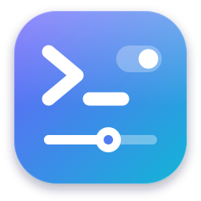

<p align="center">
  <a href="https://github.com/mumbo235/Linux-Dashboard">
    
  </a>
</p>

<h1 align="center">Linux Dashboard</h1>

<p align="center">
  <b>Everything you'd normally do in a terminal, with buttons, switches and plain-English explanations, plus an AI assistant that plans and runs tasks safely for you.</b>
</p>

<p align="center">
  <a href="https://github.com/mumbo235/Linux-Dashboard/releases"></a>
  <a href="https://github.com/mumbo235/Linux-Dashboard/wiki"></a>
  <a href="https://github.com/mumbo235/Linux-Dashboard/issues"></a>
  <a href="https://github.com/mumbo235/Linux-Dashboard/blob/main/LICENSE"></a>
</p>

---

📖 **[Read the Documentation & Wiki](https://github.com/mumbo235/Linux-Dashboard/wiki)** (also available in the [`wiki/`](wiki/) folder) • **[Report an Issue](https://github.com/mumbo235/Linux-Dashboard/issues)**

## Install

### 1. One-File Standalone Installer (`linux-dashboard-install.sh`)
Works on any supported Linux distribution. No folder to copy, no root required (asks for password only if missing system libraries are needed). Double-clicking it again later updates the app and keeps your settings.

> [!IMPORTANT]
> When downloaded through a web browser, `.sh` files lose their executable permission by default. **You must make the script executable before running it.**

- **Using the file manager (GUI)**:
  1. Right-click `linux-dashboard-install.sh` → **Properties** → **Permissions**.
  2. Tick **Allow executing file as program** (or **Is executable**).
  3. Double-click the file and click **Run** or **Execute**.

- **Using the terminal**:
  ```bash
  chmod +x linux-dashboard-install.sh
  ./linux-dashboard-install.sh
  ```
  *(Or run `bash linux-dashboard-install.sh` directly)*

  Additional options:
  ```bash
  bash linux-dashboard-install.sh --yes        # Install missing dependencies without asking
  bash linux-dashboard-install.sh --uninstall  # Uninstall (add --purge to delete settings and chats too)
  ```

---

### 2. Native System Packages

If you prefer installing system-wide for every account via your distribution's package manager:

#### Ubuntu, Debian, Linux Mint, Pop!_OS, Zorin (`.deb`)
- **GUI**: Double-click `linux-dashboard_…_all.deb` to open App Center / Software Manager / GDebi, then click **Install**.
- **Terminal**:
  ```bash
  sudo apt install ./linux-dashboard_*.deb
  ```

#### Arch Linux, Manjaro, EndeavourOS (`.pkg.tar.zst`)
- **GUI**: On Manjaro, double-click to open in **Add/Remove Software (Pamac)**.
- **Terminal**:
  ```bash
  sudo pacman -U linux-dashboard-*.pkg.tar.zst
  ```

#### Fedora (`.rpm`)
- **GUI**: Double-click `linux-dashboard-….fedora.noarch.rpm` to open in GNOME Software, then click **Install**.
- **Terminal**:
  ```bash
  sudo dnf install ./linux-dashboard-*.fedora.noarch.rpm
  ```

#### openSUSE (`.rpm`)
- **GUI**: Double-click `linux-dashboard-….opensuse.noarch.rpm` to open in YaST / Discover, then click **Install**.
- **Terminal**:
  ```bash
  sudo zypper install ./linux-dashboard-*.opensuse.noarch.rpm
  ```

---

After installing, launch **Linux Dashboard** from your application menu, or run `linux-dashboard` in a terminal.
Right-click the app's icon (menu, taskbar or desktop shortcut) to jump straight to a page, or run `linux-dashboard --page sound`. If it ever won't open, the log is in `~/.cache/linux-dashboard/app.log`.

### For developers

`bash build.sh` packs this folder into `dist/linux-dashboard-install.sh`, plus the `.deb`, `.rpm` and Arch
packages when [nfpm](https://nfpm.goreleaser.com) is installed; run it after changing anything.
From the folder itself you can also run `bash install.sh` (copies the app) or `bash install.sh --here`
(runs it from this folder, handy while editing).

## Works on

| | Software & updates | Desktop settings |
|---|---|---|
| Arch, EndeavourOS, Manjaro | pacman + AUR (yay/paru) + Flatpak | |
| Ubuntu, Debian, Mint, Pop!_OS | apt + Flatpak + Snap | |
| Fedora | dnf + Flatpak | |
| openSUSE | zypper + Flatpak | |
| **KDE Plasma** | | everything: themes, panel, effects, displays, mouse, night light |
| **GNOME** | | dark mode, accent colour, night light, wallpaper, clock, dock, workspaces, mouse, idle & lock |
| Other desktops | | the shared parts: sound, network, Bluetooth, power, services, storage, VMs… |

It needs a 2023-or-newer release (for WebKitGTK 6), systemd, and ideally NetworkManager and PipeWire.
The assistant needs an AI to talk to. In Dashboard settings → Assistant, connect Claude with an
Anthropic API key, or a key from OpenAI, Google Gemini, OpenRouter, Groq, Mistral, xAI or DeepSeek, any
OpenAI-compatible server, or a free local model with Ollama. Keys are kept in the system keyring.
Fan control is for Macs (T2 and Intel).

Settings, chats and notes are stored per user in `~/.config/linux-dashboard/`.

## If something goes wrong

| Problem | Fix |
|---|---|
| Double-clicking the installer opens a text editor | The file lost its "can run" mark when it was copied or downloaded. Right-click it → **Properties** → **Permissions** → tick **Allow executing** (*Is executable*), then double-click again. Or in a terminal: `bash linux-dashboard-install.sh` |
| The install stopped with an error window | The reason is in `~/.cache/linux-dashboard/install.log` |
| `linux-dashboard: command not found` | Open a new terminal (the installer added `~/.local/bin` to your PATH), or use the app menu |
| It doesn't open | Look at `~/.cache/linux-dashboard/app.log`, then run the installer again |
| "This installer file is damaged" | The copy got cut short. Copy `linux-dashboard-install.sh` again |
| Installing packages fails | Your account needs to be an administrator (in the `wheel` or `sudo` group), or ask one to install them |
| Pages look out of date after an update | Press Ctrl+R in the app, or quit (Ctrl+Q) and reopen it |

> [!TIP]
> **Still having an issue or spotted a bug?**
> Please open an issue on the **[GitHub Issues page](https://github.com/mumbo235/Linux-Dashboard/issues)** with your distro details and the startup log (`~/.cache/linux-dashboard/app.log`).

Each user who wants the dashboard installs it for themselves; it never changes another user's settings.

## License

MIT, © 2026 fishwick. See [LICENSE](LICENSE).
